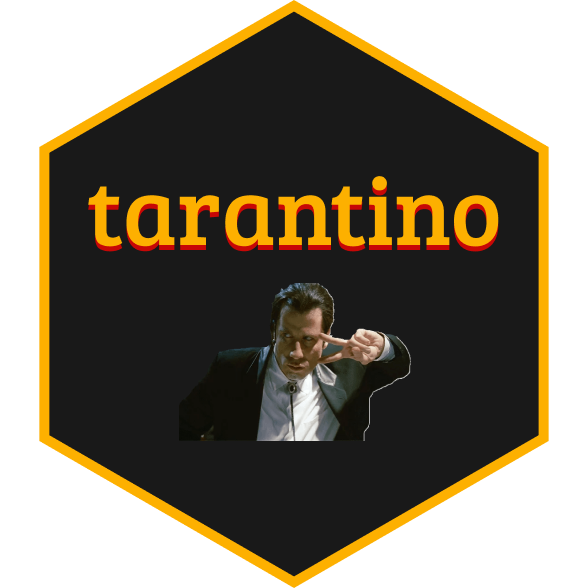
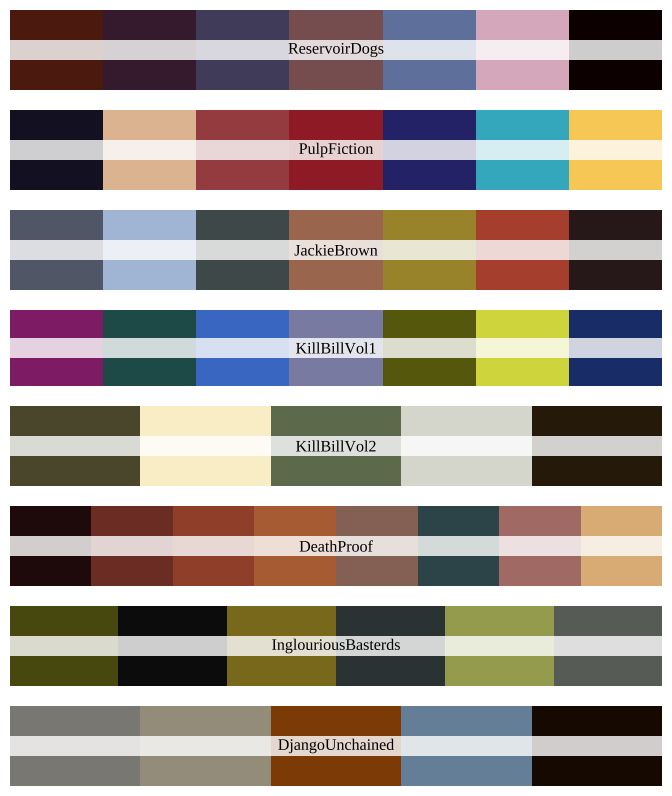

<!-- README.md is generated from README.Rmd. Please edit that file -->

```{r, include = FALSE}
knitr::opts_chunk$set(
  collapse = TRUE,
  comment = "#>",
  fig.path = "man/figures/README-",
  out.width = "100%"
)
```

# tarantino 

<!-- badges: start -->
[](https://www.tidyverse.org/lifecycle/#experimental)
<!-- badges: end -->

## Overview

This package provides a series of palettes extracted from some classic scenes of Quentin Tarantino's movies. The package itself is a modified version based on the famous [`wesanderson`](https://github.com/karthik/wesanderson) package. The raw data is collected from *[Movies in Color](https://moviesincolor.com)*.

## Installation

You can install the development version of `tarantino` with:

```{r eval=FALSE}
# install package from github
devtools::install_github("rexarski/tarantino")
```

## Palettes

**Update:** 2 new palettes from [_The Hateful Eight (2015)_](https://www.instagram.com/p/CBLdkdeIRK2/ and [_Once Upon a Time in Hollywood (2019)_](https://www.instagram.com/p/B-Pl0PAocL7/).




After loading the package, call `tarantino_palettes` to display all current available palettes, which are stored in the list. Each element within the list is a palette object.

```{r eval=FALSE}
library(tarantino)
tarantino_palettes
```

You can also use `tarantino::print_palette(palette)` to give a showcase of the palette:

```{r eval=FALSE}
tarantino::print_palette(tarantino_palette("PulpFiction", type="discrete"))
```


